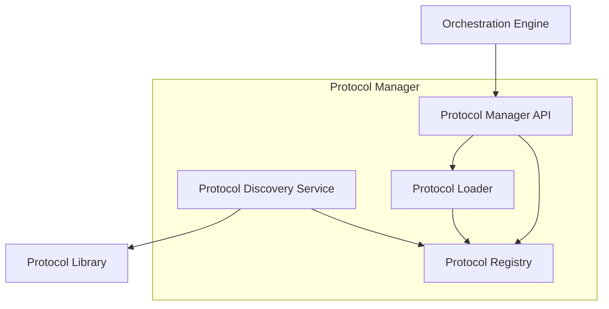

# Protocol Manager Design

This document describes the design of the Protocol Manager component for the mCP Server.

## 1. Overview

The Protocol Manager is responsible for the lifecycle management of cognitive protocols. It acts as a bridge between the Orchestration Engine and the Protocol Library, providing a structured way to discover, load, and use protocols.

## 2. Core Responsibilities

*   **Protocol Discovery:** Automatically discover protocols available in the Protocol Library.
*   **Protocol Registration:** Maintain a registry of all available protocols, including their metadata.
*   **Protocol Lifecycle Management:** Load protocols into memory when needed and unload them to conserve resources.
*   **Protocol Abstraction:** Provide a consistent interface for the Orchestration Engine to interact with protocols, regardless of their underlying implementation.

## 3. Protocol Packaging

To facilitate discovery and loading, each protocol must be packaged in a standardized format. Each protocol will be a directory containing:

*   The protocol's implementation (e.g., compiled code, scripts).
*   A manifest file (`protocol.json`) that describes the protocol.

### 3.1. The `protocol.json` Manifest

The `protocol.json` file is a key part of the design. It will contain the following information:

```json
{
  "name": "ReadabilityEnhancementProtocol",
  "version": "1.0.0",
  "entryPoint": "com.simone.protocols.rep.REP",
  "type": "Aesthetic",
  "dependencies": [],
  "resourceRequirements": {
    "cpu": "100m",
    "memory": "128Mi"
  }
}
```

*   `name`: The unique name of the protocol.
*   `version`: The version of the protocol.
*   `entryPoint`: The main class or function that the Protocol Manager should use to instantiate the protocol.
*   `type`: The type of protocol (e.g., "Logical", "Aesthetic"). This helps the Orchestration Engine make decisions.
*   `dependencies`: A list of other protocols that this protocol depends on.
*   `resourceRequirements`: The expected resource usage of the protocol. This information is used by the Resource Manager.

## 4. Components

### 4.1. Protocol Discovery Service

This service is responsible for finding protocols in the Protocol Library. It will:

*   Scan the Protocol Library directory for subdirectories containing a `protocol.json` file.
*   Read the `protocol.json` file to get the protocol's metadata.
*   Notify the Protocol Registry of any new or updated protocols.

This service can be triggered at server startup and can also be configured to watch the directory for changes.

### 4.2. Protocol Registry

The Protocol Registry is an in-memory database of all known protocols. It will store the metadata from the `protocol.json` files and the current state of each protocol (e.g., `unloaded`, `loaded`, `active`).

### 4.3. Protocol Loader

The Protocol Loader is responsible for loading the protocol's code into memory. The implementation of the loader will depend on the technology stack of the mCP server. For example:

*   **Java:** The loader would use a `URLClassLoader` to load the protocol's JAR files.
*   **Python:** The loader would use `importlib` to load the protocol's module.
*   **Plugin-based architecture:** A more advanced implementation could use a plugin framework like OSGi (for Java) or similar frameworks in other languages.

### 4.4. Protocol Manager API

The Protocol Manager will expose an internal API for the Orchestration Engine. The API will include the following functions:

*   `listProtocols()`: Returns a list of all available protocols.
*   `getProtocol(name, version)`: Returns an instance of the specified protocol. If the protocol is not loaded, the Protocol Manager will load it first.
*   `releaseProtocol(instance)`: Releases the protocol instance. The Protocol Manager can then decide whether to unload the protocol's code from memory.

## 5. Diagram



This design provides a flexible and extensible way to manage protocols in the mCP Server. It allows for new protocols to be added without restarting the server and provides a clear separation of concerns between the different components.
