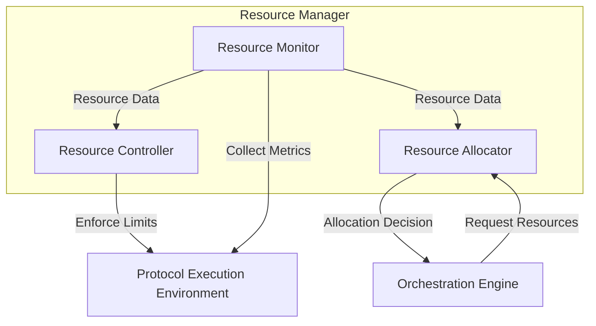

# Resource Manager Design

This document outlines the design of the Resource Manager component for the mCP Server.

## 1. Overview

The Resource Manager is responsible for monitoring and controlling the computational resources used by the cognitive protocols. This component is essential for ensuring the stability, performance, and energy efficiency of the mCP Server, in line with the principle of Energy Stewardship (Law 4).

## 2. Core Responsibilities

*   **Resource Monitoring:** Continuously monitor the CPU, memory, and I/O usage of each protocol and the server as a whole.
*   **Resource Limiting:** Enforce resource quotas on protocols to prevent any single protocol from monopolizing system resources.
*   **Resource Allocation:** Work with the Orchestration Engine to make intelligent decisions about scheduling and executing tasks based on resource availability.
*   **Reporting:** Provide data and reports on resource consumption for auditing and optimization purposes.

## 3. Resource Monitoring

The Resource Manager will use a combination of system-level tools and application-level instrumentation to monitor resource usage.

*   **System-Level Monitoring:** It will leverage operating system utilities (like `ps`, `top`, or the `/proc` filesystem in Linux) or platform-specific tools (like `cgroups`) to gather data on CPU and memory consumption for the processes or threads running the protocols.
*   **Application-Level Monitoring:** For more fine-grained data, the Resource Manager will rely on the protocols themselves to report their resource usage. This can be done through a callback mechanism or by having the protocols expose metrics via a standardized endpoint.

The collected data will be stored in a time-series database for analysis and visualization.

## 4. Resource Control

The Resource Manager will enforce resource limits on the protocols. This is critical for preventing resource exhaustion and ensuring fairness among tasks.

*   **CPU Limiting:** The manager will use techniques like CPU affinity and thread priority to control the amount of CPU time a protocol can consume. In a containerized environment, CPU shares and quotas can be used.
*   **Memory Limiting:** The manager will set a maximum memory allocation for each protocol. If a protocol exceeds its allocation, it can be terminated or paused.
*   **I/O Limiting:** The manager will throttle the I/O operations of protocols to prevent them from overwhelming the storage and network subsystems.

## 5. Resource Allocation

The Resource Manager will work closely with the Orchestration Engine to make resource-aware scheduling decisions.

*   **Admission Control:** When a new task is submitted, the Orchestration Engine will consult the Resource Manager to determine if there are enough resources to execute it. If not, the task will be placed in a queue.
*   **Dynamic Allocation:** The Resource Manager can provide feedback to the Orchestration Engine to dynamically adjust the number of parallel tasks based on the current resource utilization.
*   **Protocol-Specific Allocation:** The Resource Manager will use the `resourceRequirements` field in the `protocol.json` manifest to make more accurate allocation decisions.

## 6. Integration with Protocols

Protocols are expected to be good citizens in the ecosystem. The `protocol.json` manifest allows them to declare their expected resource needs.

```json
"resourceRequirements": {
  "cpu": "100m",      // 0.1 core
  "memory": "128Mi",  // 128 Mebibytes
  "io_bandwidth": "10Mi" // 10 Mebibytes/sec
}
```

This information allows the Resource Manager to proactively allocate the necessary resources and to ensure that the protocol has what it needs to run effectively without impacting other protocols.

## 7. Diagram



By implementing a robust Resource Manager, the mCP Server can ensure that it operates in a stable, predictable, and efficient manner, upholding the core principles of the SIM-ONE framework.
