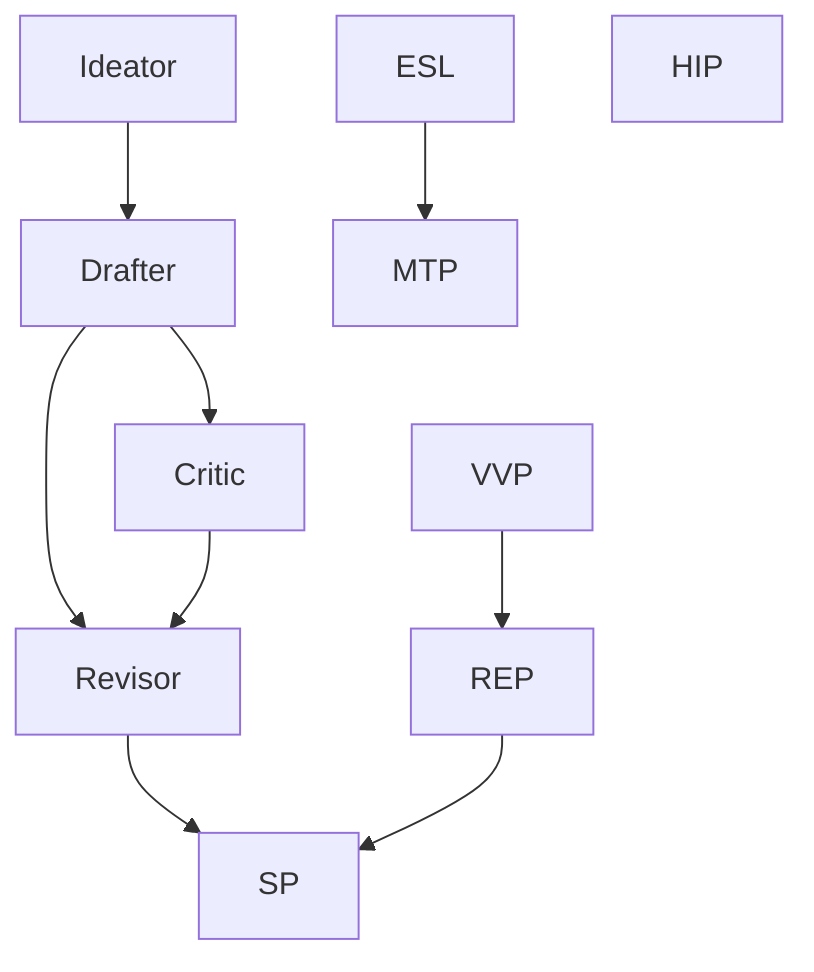

# SIM-ONE Cognitive Protocols Documentation

## Overview

The SIM-ONE mCP Server implements a sophisticated set of cognitive protocols designed to provide multi-layered intelligence processing. This document provides comprehensive documentation for all available cognitive protocols, their functionality, usage patterns, and integration capabilities.

## Protocol Architecture

The cognitive protocols are organized into distinct types based on their primary function:
- **Logical**: Reasoning and logical inference protocols
- **Analysis**: Data analysis and extraction protocols  
- **Generative**: Content creation and generation protocols
- **Validation**: Input validation and verification protocols

## Individual Protocol Documentation

### 1. REP (Reasoning and Explanation Protocol)

**Name**: ReasoningAndExplanationProtocol  
**Version**: 1.0.0  
**Type**: Logical  
**Entry Point**: `mcp_server.protocols.rep.rep.REP`  
**Dependencies**: None  
**Resource Requirements**: CPU: 200m, Memory: 256Mi

#### Purpose and Functionality
The REP protocol implements advanced reasoning capabilities supporting multiple reasoning paradigms including deductive, inductive, abductive, analogical, and causal reasoning. It provides logical validation and confidence scoring for conclusions.

#### Algorithm Description
- **Deductive Reasoning**: Implements forward chaining with modus ponens and modus tollens
- **Inductive Reasoning**: Pattern detection and generalization from observations
- **Abductive Reasoning**: Best explanation inference with hypothesis scoring
- **Analogical Reasoning**: Structural similarity mapping between cases
- **Causal Reasoning**: Temporal pattern analysis for cause-effect relationships
- **Auto-reasoning**: Automatic selection of optimal reasoning type based on input

#### Input/Output Specifications

**Input Structure**:
```json
{
  "facts": ["list of known facts"],
  "rules": [["premises"], "conclusion"],
  "reasoning_type": "deductive|inductive|abductive|analogical|causal|auto",
  "observations": ["list of observations for inductive reasoning"],
  "hypotheses": ["list of hypotheses for abductive reasoning"],
  "source_case": {"source case object for analogical reasoning"},
  "target_case": {"target case object for analogical reasoning"},
  "events": [{"event objects for causal reasoning"}],
  "context": "additional context information"
}
```

**Output Structure**:
```json
{
  "reasoning_type": "selected reasoning type",
  "conclusions": ["list of derived conclusions"],
  "confidence_scores": {"conclusion": confidence_value},
  "reasoning_chain": [
    {
      "type": "reasoning_type",
      "premises": ["premises"],
      "conclusion": "conclusion",
      "confidence": 0.8,
      "explanation": "step explanation"
    }
  ],
  "validation": {
    "is_valid": true,
    "issues": ["list of issues"],
    "confidence_score": 0.9
  },
  "explanation": "human-readable reasoning process explanation"
}
```

#### Usage Examples

**Deductive Reasoning Example**:
```python
rep = REP()
data = {
    "reasoning_type": "deductive",
    "facts": ["Socrates is a man", "All men are mortal"],
    "rules": [
        (["Socrates is a man", "All men are mortal"], "Socrates is mortal")
    ]
}
result = rep.execute(data)
```

**Inductive Reasoning Example**:
```python
data = {
    "reasoning_type": "inductive",
    "observations": [
        "The sun rose in the east today",
        "The sun rose in the east yesterday", 
        "The sun rose in the east last week"
    ]
}
result = rep.execute(data)
```

#### Performance Characteristics
- **Complexity**: O(n²) for deductive reasoning with n rules
- **Memory Usage**: Linear with respect to fact base size
- **Confidence Degradation**: 5% per reasoning step to model uncertainty
- **Validation**: Contradiction detection and logical consistency checking

---

### 2. ESL (Emotional State Layer)

**Name**: EmotionalStateLayerProtocol  
**Version**: 1.0.0  
**Type**: Analysis  
**Entry Point**: `mcp_server.protocols.esl.esl.ESL`  
**Dependencies**: None  
**Resource Requirements**: CPU: 50m, Memory: 64Mi

#### Purpose and Functionality
The ESL protocol performs sophisticated multi-dimensional emotion detection using rule-based pattern matching. It analyzes text input to identify emotional states across primary, social, and cognitive emotion dimensions.

#### Algorithm Description
- **Pattern Matching**: Regex-based emotion detection with contextual modifiers
- **Multi-dimensional Analysis**: Categorizes emotions into primary, social, and cognitive dimensions
- **Contextual Scoring**: Applies intensity and confidence modifiers based on linguistic context
- **Valence Analysis**: Determines positive, negative, neutral, or mixed emotional valence
- **Aggregation**: Combines multiple emotion detections with confidence weighting

#### Input/Output Specifications

**Input Structure**:
```json
{
  "user_input": "text to analyze for emotional content"
}
```

**Output Structure**:
```json
{
  "emotional_state": "dominant_emotion",
  "valence": "positive|negative|neutral|mixed",
  "intensity": 0.8,
  "salience": 0.7,
  "confidence": 0.9,
  "detected_emotions": [
    {
      "emotion": "emotion_name",
      "intensity": 0.8,
      "confidence": 0.9,
      "dimension": "primary|social|cognitive",
      "valence": "positive|negative|neutral"
    }
  ],
  "contextual_factors": {
    "is_question": true,
    "has_negation": false,
    "temporal_indicators": ["always", "never"]
  },
  "explanation": "detailed analysis explanation",
  "analysis_type": "linguistic_patterns",
  "ml_ready": true
}
```

#### Emotion Categories

**Primary Emotions**:
- Joy (positive valence)
- Sadness (negative valence) 
- Anger (negative valence)
- Fear (negative valence)
- Surprise (neutral valence)
- Disgust (negative valence)

**Social Emotions**:
- Gratitude (positive valence)
- Empathy (positive valence)
- Pride (positive valence) 
- Guilt (negative valence)
- Envy (negative valence)

**Cognitive Emotions**:
- Hope (positive valence)
- Curiosity (neutral valence)
- Confusion (negative valence)
- Confidence (positive valence)
- Doubt (negative valence)

#### Usage Examples

**Basic Emotion Analysis**:
```python
esl = ESL()
data = {"user_input": "I'm absolutely thrilled about this amazing opportunity!"}
result = esl.execute(data)
# Result: dominant emotion "joy" with high intensity and positive valence
```

**Complex Mixed Emotions**:
```python
data = {"user_input": "I'm angry and frustrated, but I guess I'm also a little hopeful."}
result = esl.execute(data)
# Result: mixed valence with multiple detected emotions
```

#### Performance Characteristics
- **Processing Speed**: Real-time analysis for texts up to 1000 words
- **Pattern Coverage**: 35+ emotion patterns with contextual modifiers
- **Accuracy**: High precision for explicit emotional language
- **Context Window**: 40-character context analysis for modifier detection

---

### 3. MTP (Memory Tagger Protocol)

**Name**: MemoryTaggerProtocol  
**Version**: 1.0.0  
**Type**: Analysis  
**Entry Point**: `mcp_server.protocols.mtp.mtp.MTP`  
**Dependencies**: None  
**Resource Requirements**: CPU: 50m, Memory: 64Mi

#### Purpose and Functionality
The MTP protocol performs sophisticated entity extraction, relationship detection, and emotional tagging for memory storage. It identifies named entities, establishes relationships between them, and creates memory tags with emotional context.

#### Algorithm Description
- **Entity Extraction**: Multi-pattern regex extraction with priority ordering
- **Relationship Detection**: Contextual relationship identification between entities
- **Overlap Prevention**: Span-based deduplication to prevent entity overlaps
- **Salience Calculation**: Importance scoring based on entity type and frequency
- **Memory Tag Creation**: Integration with emotional context for memory storage

#### Entity Types and Patterns

**Person Entities**:
- Title-based patterns: "Mr.", "Mrs.", "Dr.", "CEO", etc.
- Proper noun patterns with contextual validation

**Organization Entities**:
- Company suffix patterns: "Inc.", "Corp.", "LLC", "Ltd."
- Known company names: "Microsoft", "OpenAI", "Google"

**Place Entities**:
- Location keywords: "Seattle", "downtown", "New York", "California"

**Event Entities**:
- Time-based events: "meeting", "appointment", "conference"
- Temporal indicators: "tomorrow", "today", "next week"

**Object and Concept Entities**:
- Physical objects: "iPhone", "computer", "document"
- Abstract concepts: "project", "idea", "system", "stress"

#### Relationship Types

**works_at**: Person-Organization relationships
**located_in**: Person-Place relationships  
**related_to**: General entity relationships
**meeting_with**: Event-Person relationships

#### Input/Output Specifications

**Input Structure**:
```json
{
  "user_input": "text to analyze for entities",
  "emotional_context": {
    "valence": "positive|negative|neutral",
    "detected_emotions": [{"emotion": "joy", "intensity": 0.8}]
  },
  "session_id": "unique_session_identifier"
}
```

**Output Structure**:
```json
{
  "extracted_entities": [
    {
      "entity": "entity_name",
      "type": "person|organization|place|event|object|concept",
      "salience": 0.7,
      "emotional_state": "positive",
      "context": "surrounding text context",
      "relationships": ["related_entities"],
      "confidence": 0.85,
      "first_mention": true
    }
  ],
  "entity_relationships": [
    {
      "source": "source_entity",
      "target": "target_entity", 
      "relationship_type": "works_at|located_in|related_to",
      "strength": 0.9
    }
  ],
  "memory_tags": [
    {
      "entity": "entity_name",
      "emotions": "[JSON serialized emotions]",
      "emotional_state": "positive",
      "source_input": "original input text",
      "emotional_salience": 0.7,
      "source_protocol": "MTP"
    }
  ],
  "contextual_factors": {
    "entity_count": 3,
    "new_entities": 2
  },
  "explanation": "processing summary"
}
```

#### Usage Examples

**Entity and Relationship Extraction**:
```python
mtp = MTP()
data = {
    "user_input": "John works at Microsoft and lives in Seattle.",
    "emotional_context": {"valence": "positive"},
    "session_id": "session-123"
}
result = mtp.execute(data)
# Extracts: John (person), Microsoft (organization), Seattle (place)
# Relationships: John works_at Microsoft, John located_in Seattle
```

#### Performance Characteristics
- **Entity Processing Order**: Organization → Place → Person → Event → Object → Concept
- **Overlap Resolution**: Span-based deduplication prevents false positives
- **Relationship Validation**: Type-checking ensures valid entity pairings
- **Memory Integration**: Automatic storage of tagged entities with emotional context

---

### 4. HIP (Hierarchical Information Processing)

**Name**: HyperlinkInterpretationProtocol  
**Version**: 1.0.0  
**Type**: Validation  
**Entry Point**: `mcp_server.protocols.hip.hip.HIPProtocol`  
**Dependencies**: None  
**Resource Requirements**: CPU: 20m, Memory: 32Mi

#### Purpose and Functionality
The HIP protocol analyzes URLs and determines whether they should be followed based on security and content relevance rules. It provides URL validation and filtering capabilities for web content processing.

#### Algorithm Description
- **URL Parsing**: Uses urllib.parse for robust URL decomposition
- **Scheme Validation**: Ensures only safe protocols (http, https) are allowed
- **Domain Filtering**: Checks against banned domain lists
- **Path Analysis**: Scans URL paths for ignored keywords
- **Decision Engine**: Binary classification (follow/ignore) with reasoning

#### Configuration Options

**Banned Domains**: Configurable list of domains to ignore
```python
banned_domains = {"example.com", "somesite.org"}
```

**Ignore Keywords**: Path keywords that trigger ignore decisions
```python
ignore_keywords = {"login", "signup", "about", "contact", "privacy"}
```

**Allowed Schemes**: Permitted URL schemes
```python
allowed_schemes = {"http", "https"}
```

#### Input/Output Specifications

**Input Structure**:
```json
{
  "url": "https://example.com/path/to/resource"
}
```

**Output Structure**:
```json
{
  "action": "follow|ignore",
  "reason": "explanation for the decision"
}
```

#### Usage Examples

**URL Validation**:
```python
hip = HIPProtocol()

# Valid URL
result = hip.execute({"url": "https://www.good-source.com/article/123"})
# Result: {"action": "follow", "reason": "URL passed all checks."}

# Banned domain
result = hip.execute({"url": "https://example.com/some-page"})
# Result: {"action": "ignore", "reason": "Domain 'example.com' is on the ban list."}

# Ignored keyword
result = hip.execute({"url": "https://www.good-source.com/about-us"})
# Result: {"action": "ignore", "reason": "URL path contains ignored keyword: 'about'."}
```

#### Performance Characteristics
- **Processing Speed**: Microsecond-level URL analysis
- **Memory Usage**: Minimal, stateless processing
- **Extensibility**: Easy configuration updates for rules
- **Error Handling**: Graceful handling of malformed URLs

---

### 5. Ideator Protocol

**Name**: IdeatorProtocol  
**Version**: 1.0.0  
**Type**: Generative  
**Entry Point**: `mcp_server.protocols.ideator.ideator.IdeatorProtocol`  
**Dependencies**: None  
**Resource Requirements**: CPU: 200m, Memory: 256Mi

#### Purpose and Functionality
The Ideator protocol generates creative ideas on topics using neural language models augmented with web research and conversational memory. It provides comprehensive idea generation with supporting research context.

#### Algorithm Description
- **Memory Integration**: Retrieves relevant conversational memories for context
- **Research Augmentation**: Performs RAG-based web research on the topic
- **Prompt Construction**: Builds comprehensive prompts with memory and research context
- **Idea Generation**: Uses neural engine for creative idea synthesis
- **Output Processing**: Structures generated ideas into organized lists

#### Input/Output Specifications

**Input Structure**:
```json
{
  "topic": "topic for idea generation",
  "batch_memory": [
    {
      "entity": "entity_name",
      "emotional_state": "positive"
    }
  ],
  "latency_info": {
    "budget_ms": 5000,
    "used_ms": 1000
  }
}
```

**Output Structure**:
```json
{
  "ideas": [
    "1. Comprehensive idea with context and rationale",
    "2. Another creative approach based on research",
    "3. Memory-informed suggestion"
  ],
  "research_context": "supporting research material"
}
```

#### Usage Examples

**Topic-based Idea Generation**:
```python
ideator = IdeatorProtocol()
data = {
    "topic": "sustainable energy solutions",
    "batch_memory": [
        {"entity": "solar power", "emotional_state": "positive"}
    ]
}
result = await ideator.execute(data)
# Generates 5-7 ideas informed by memory context and research
```

#### Performance Characteristics
- **Idea Count**: Generates 5-7 comprehensive ideas per request
- **Research Integration**: RAG-enhanced with web search capabilities
- **Memory Utilization**: Leverages conversational context for personalized ideas
- **Latency Management**: Respects latency budgets for real-time performance

---

### 6. Critic Protocol

**Name**: CriticProtocol  
**Version**: 1.0.0  
**Type**: Analysis  
**Entry Point**: `mcp_server.protocols.critic.critic.CriticProtocol`  
**Dependencies**: ["DrafterProtocol"]  
**Resource Requirements**: CPU: 200m, Memory: 256Mi

#### Purpose and Functionality
The Critic protocol analyzes drafts from the Drafter protocol, performs fact-checking, and provides detailed feedback informed by memory context and research validation.

#### Algorithm Description
- **Draft Analysis**: Examines text from Drafter or Revisor protocols
- **Claim Extraction**: Identifies factual claims requiring verification
- **Fact-checking**: Uses RAG research for claim validation
- **Memory Integration**: Incorporates conversational context for critique
- **Feedback Generation**: Produces structured critical analysis

#### Input/Output Specifications

**Input Structure**:
```json
{
  "DrafterProtocol": {"draft_text": "text to critique"},
  "RevisorProtocol": {"revised_draft_text": "revised text"},
  "batch_memory": ["memory objects"],
  "latency_info": {"budget_ms": 5000}
}
```

**Output Structure**:
```json
{
  "feedback": [
    "1. Specific critique point with evidence",
    "2. Fact-checking result with research backing",
    "3. Suggestion for improvement"
  ]
}
```

#### Usage Examples

**Draft Critique**:
```python
critic = CriticProtocol()
data = {
    "DrafterProtocol": {
        "draft_text": "The solar industry has grown rapidly in recent years."
    },
    "latency_info": {"budget_ms": 3000}
}
result = await critic.execute(data)
# Returns detailed critique with fact-checking
```

#### Performance Characteristics
- **Fact-checking**: Research-backed claim validation
- **Latency Awareness**: Respects processing time budgets
- **Memory Integration**: Context-aware critique generation
- **Structured Output**: Numbered feedback points for clarity

---

### 7. Drafter Protocol

**Name**: DrafterProtocol  
**Version**: 1.0.0  
**Type**: Generative  
**Entry Point**: `mcp_server.protocols.drafter.drafter.DrafterProtocol`  
**Dependencies**: ["IdeatorProtocol"]  
**Resource Requirements**: CPU: 100m, Memory: 128Mi

#### Purpose and Functionality
The Drafter protocol creates comprehensive first drafts based on ideas from the Ideator protocol, incorporating research context and conversational memory for personalized content generation.

#### Algorithm Description
- **Idea Integration**: Processes structured ideas from Ideator protocol
- **Research Incorporation**: Weaves supporting research into draft content
- **Memory Contextualization**: Uses conversational memory for tone and style consistency
- **Document Structuring**: Creates well-organized draft documents
- **Content Generation**: Neural engine-powered text synthesis

#### Input/Output Specifications

**Input Structure**:
```json
{
  "IdeatorProtocol": {
    "ideas": ["list of ideas to develop"],
    "research_context": "supporting research material"
  },
  "batch_memory": [
    {"entity": "entity_name", "emotional_state": "positive"}
  ]
}
```

**Output Structure**:
```json
{
  "draft_text": "comprehensive first draft document"
}
```

#### Usage Examples

**Draft Generation**:
```python
drafter = DrafterProtocol()
data = {
    "IdeatorProtocol": {
        "ideas": [
            "1. Implement renewable energy incentives",
            "2. Develop smart grid infrastructure"
        ],
        "research_context": "Recent studies show..."
    },
    "batch_memory": [
        {"entity": "sustainability", "emotional_state": "positive"}
    ]
}
result = drafter.execute(data)
# Creates structured draft document
```

#### Performance Characteristics
- **Content Quality**: Research-informed, comprehensive drafts
- **Memory Consistency**: Maintains conversational tone and context
- **Structure**: Well-organized document formatting
- **Integration**: Seamlessly incorporates multiple idea sources

---

### 8. Revisor Protocol

**Name**: RevisorProtocol  
**Version**: 1.0.0  
**Type**: Generative  
**Entry Point**: `mcp_server.protocols.revisor.revisor.RevisorProtocol`  
**Dependencies**: ["DrafterProtocol", "CriticProtocol"]  
**Resource Requirements**: CPU: 200m, Memory: 256Mi

#### Purpose and Functionality
The Revisor protocol refines drafts based on feedback from the Critic protocol, incorporating additional research and maintaining consistency with conversational memory.

#### Algorithm Description
- **Feedback Analysis**: Processes critique points from Critic protocol
- **Research Integration**: Conducts targeted research based on feedback
- **Memory Alignment**: Ensures revised content aligns with conversational context
- **Draft Revision**: Comprehensive rewriting and polishing
- **Quality Enhancement**: Improves factual accuracy and readability

#### Input/Output Specifications

**Input Structure**:
```json
{
  "DrafterProtocol": {"draft_text": "original draft"},
  "RevisorProtocol": {"revised_draft_text": "previous revision"},
  "CriticProtocol": {"feedback": ["critique points"]},
  "batch_memory": ["memory objects"],
  "latency_info": {"budget_ms": 4000}
}
```

**Output Structure**:
```json
{
  "revised_draft_text": "fully revised and polished document"
}
```

#### Usage Examples

**Draft Revision**:
```python
revisor = RevisorProtocol()
data = {
    "DrafterProtocol": {"draft_text": "Original draft text"},
    "CriticProtocol": {"feedback": ["Add more examples", "Verify statistics"]},
    "latency_info": {"budget_ms": 5000}
}
result = await revisor.execute(data)
# Returns comprehensively revised document
```

#### Performance Characteristics
- **Research Targeting**: Selective research based on specific feedback
- **Latency Management**: Optimizes research scope within time constraints
- **Quality Improvement**: Significant enhancement over initial drafts
- **Context Preservation**: Maintains memory-informed tone and style

---

### 9. SP (Summary Protocol)

**Name**: SummarizerProtocol  
**Version**: 1.0.0  
**Type**: Generative  
**Entry Point**: `mcp_server.protocols.sp.sp.SP`  
**Dependencies**: ["ReasoningAndExplanationProtocol"]  
**Resource Requirements**: CPU: 100m, Memory: 128Mi

#### Purpose and Functionality
The SP protocol creates concise, executive-level summaries of documents from the drafting and revision workflow. It prioritizes revised content while providing fallback summarization capabilities.

#### Algorithm Description
- **Content Prioritization**: Prefers revised drafts over initial drafts
- **Executive Summarization**: Creates high-level, polished summaries
- **Structured Processing**: Single-paragraph summary generation
- **Quality Control**: Ensures summary completeness and coherence

#### Input/Output Specifications

**Input Structure**:
```json
{
  "RevisorProtocol": {"revised_draft_text": "revised document"},
  "DrafterProtocol": {"draft_text": "original draft"}
}
```

**Output Structure**:
```json
{
  "summary": "concise executive-level summary paragraph",
  "status": "success|skipped"
}
```

#### Usage Examples

**Document Summarization**:
```python
sp = SP()
data = {
    "RevisorProtocol": {
        "revised_draft_text": "Long detailed document about renewable energy policies..."
    }
}
result = sp.execute(data)
# Returns concise executive summary
```

**Fallback Summarization**:
```python
data = {
    "DrafterProtocol": {
        "draft_text": "Initial draft document content..."
    }
}
result = sp.execute(data)
# Summarizes original draft when revision unavailable
```

#### Performance Characteristics
- **Summary Length**: Single, well-structured paragraph
- **Content Priority**: Revised content takes precedence
- **Quality Focus**: Executive-level clarity and conciseness
- **Fallback Handling**: Graceful degradation to available content

---

### 10. VVP (Verification and Validation Protocol)

**Name**: ValidationAndVerificationProtocol  
**Version**: 1.0.0  
**Type**: Validation  
**Entry Point**: `mcp_server.protocols.vvp.vvp.VVP`  
**Dependencies**: None  
**Resource Requirements**: CPU: 50m, Memory: 64Mi

#### Purpose and Functionality
The VVP protocol validates input data structure and format to ensure proper workflow execution. It performs rule validation and input sanitization for reasoning protocols.

#### Algorithm Description
- **Input Validation**: Checks data structure compliance
- **Rule Validation**: Ensures rule format correctness
- **Type Checking**: Validates data types and structures
- **Parallel Execution Support**: Enables concurrent protocol execution

#### Input/Output Specifications

**Input Structure**:
```json
{
  "facts": ["list of facts"],
  "rules": [
    [["premise1", "premise2"], "conclusion"]
  ]
}
```

**Output Structure**:
```json
{
  "validation_status": "success|failure",
  "reason": "detailed explanation of validation result"
}
```

#### Validation Rules

**Rule Structure Requirements**:
- Rules must be provided as a list
- Each rule must be a two-element list: [premises, conclusion]
- Premises must be a list of strings
- Conclusion must be a string

#### Usage Examples

**Successful Validation**:
```python
vvp = VVP()
data = {
    "facts": ["fact1", "fact2"],
    "rules": [
        [["fact1"], "conclusion1"],
        [["fact2"], "conclusion2"]
    ]
}
result = vvp.execute(data)
# Returns: {"validation_status": "success", "reason": "..."}
```

**Failed Validation**:
```python
data = {
    "facts": ["fact1"],
    "rules": ["invalid rule format"]  # Should be list of lists
}
result = vvp.execute(data)
# Returns: {"validation_status": "failure", "reason": "..."}
```

#### Performance Characteristics
- **Processing Speed**: Lightweight validation with minimal overhead
- **Error Detection**: Comprehensive input format checking
- **Parallel Support**: Enables concurrent protocol execution
- **Clear Feedback**: Detailed validation error messages

---

## Protocol Dependencies and Workflows

### Dependency Graph



### Common Workflow Patterns

#### 1. Document Generation Workflow
```
Ideator → Drafter → Critic → Revisor → SP
```
This workflow creates comprehensive documents with iterative improvement:
1. **Ideator**: Generates topic-based ideas with research
2. **Drafter**: Creates initial draft from ideas
3. **Critic**: Analyzes draft and provides feedback
4. **Revisor**: Refines draft based on critique
5. **SP**: Creates executive summary

#### 2. Analysis and Memory Workflow  
```
ESL → MTP
```
This workflow processes user input for emotional and entity analysis:
1. **ESL**: Analyzes emotional content
2. **MTP**: Extracts entities with emotional tagging

#### 3. Reasoning and Validation Workflow
```
VVP → REP → SP
```
This workflow performs logical reasoning with validation:
1. **VVP**: Validates input structure
2. **REP**: Performs logical reasoning
3. **SP**: Summarizes reasoning results

#### 4. URL Processing Workflow
```
HIP → [External Processing]
```
Standalone workflow for URL validation and filtering.

## Configuration and Usage Patterns

### Individual Protocol Usage

Each protocol can be used independently for specific tasks:

```python
# Emotional analysis
esl = ESL()
result = esl.execute({"user_input": "I'm excited about this project!"})

# Entity extraction
mtp = MTP()  
result = mtp.execute({
    "user_input": "John works at Microsoft",
    "emotional_context": {"valence": "positive"},
    "session_id": "session-123"
})

# Logical reasoning
rep = REP()
result = rep.execute({
    "reasoning_type": "deductive",
    "facts": ["All birds can fly", "Penguins are birds"],
    "rules": [(["All birds can fly", "Penguins are birds"], "Penguins can fly")]
})
```

### Workflow Integration

Protocols can be chained together through the orchestration engine:

```python
# Document generation workflow
workflow_config = {
    "protocols": ["Ideator", "Drafter", "Critic", "Revisor", "SP"],
    "initial_data": {"topic": "renewable energy strategies"}
}

# Analysis workflow  
workflow_config = {
    "protocols": ["ESL", "MTP"],
    "initial_data": {
        "user_input": "I love working at Google in San Francisco",
        "session_id": "user-session-456"
    }
}
```

### Performance Optimization

**Resource Requirements Summary**:
- **High CPU**: REP (200m), Ideator (200m), Critic (200m), Revisor (200m)
- **Medium CPU**: Drafter (100m), SP (100m) 
- **Low CPU**: ESL (50m), MTP (50m), VVP (50m), HIP (20m)

**Memory Requirements Summary**:
- **High Memory**: REP (256Mi), Ideator (256Mi), Critic (256Mi), Revisor (256Mi)
- **Medium Memory**: Drafter (128Mi), SP (128Mi)
- **Low Memory**: ESL (64Mi), MTP (64Mi), VVP (64Mi), HIP (32Mi)

### Best Practices

1. **Protocol Selection**: Choose protocols based on specific task requirements
2. **Resource Planning**: Consider CPU and memory requirements for concurrent execution
3. **Dependency Management**: Respect protocol dependencies in workflow design
4. **Error Handling**: Implement fallback strategies for protocol failures
5. **Context Management**: Maintain session context across protocol executions
6. **Performance Monitoring**: Track execution times and resource usage

## Integration Examples

### Full Document Generation Pipeline

```python
import asyncio
from mcp_server.protocols import *

async def document_generation_pipeline(topic):
    # Step 1: Generate ideas
    ideator = IdeatorProtocol()
    ideas_result = await ideator.execute({
        "topic": topic,
        "latency_info": {"budget_ms": 5000}
    })
    
    # Step 2: Create initial draft
    drafter = DrafterProtocol()
    draft_result = drafter.execute({
        "IdeatorProtocol": ideas_result
    })
    
    # Step 3: Critique the draft
    critic = CriticProtocol()
    critique_result = await critic.execute({
        "DrafterProtocol": draft_result,
        "latency_info": {"budget_ms": 3000}
    })
    
    # Step 4: Revise based on critique
    revisor = RevisorProtocol()
    revision_result = await revisor.execute({
        "DrafterProtocol": draft_result,
        "CriticProtocol": critique_result,
        "latency_info": {"budget_ms": 4000}
    })
    
    # Step 5: Create summary
    summarizer = SP()
    summary_result = summarizer.execute({
        "RevisorProtocol": revision_result
    })
    
    return {
        "ideas": ideas_result["ideas"],
        "draft": draft_result["draft_text"],
        "critique": critique_result["feedback"], 
        "revision": revision_result["revised_draft_text"],
        "summary": summary_result["summary"]
    }

# Usage
result = asyncio.run(document_generation_pipeline("sustainable transportation"))
```

### Conversational Analysis Pipeline

```python
def analyze_conversation(user_input, session_id):
    # Step 1: Emotional analysis
    esl = ESL()
    emotion_result = esl.execute({"user_input": user_input})
    
    # Step 2: Entity extraction with emotional context
    mtp = MTP()
    entity_result = mtp.execute({
        "user_input": user_input,
        "emotional_context": emotion_result,
        "session_id": session_id
    })
    
    return {
        "emotions": emotion_result,
        "entities": entity_result["extracted_entities"],
        "relationships": entity_result["entity_relationships"],
        "memory_tags": entity_result["memory_tags"]
    }

# Usage
result = analyze_conversation(
    "I'm really excited about my new job at Tesla in Austin!",
    "user-session-789"
)
```

This comprehensive documentation provides detailed information about each cognitive protocol in the SIM-ONE mCP Server, including their functionality, usage patterns, integration capabilities, and performance characteristics. The protocols work together to provide sophisticated multi-layered intelligence processing for various cognitive tasks.