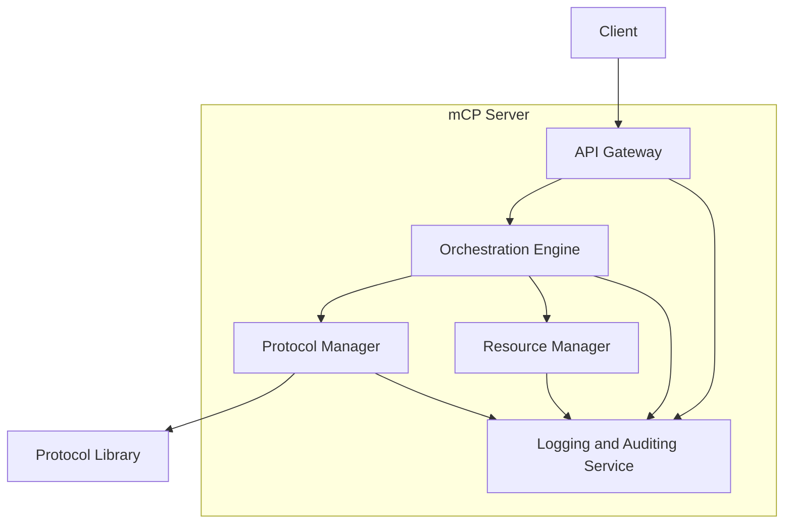

# mCP Server Architecture

This document outlines the high-level architecture for the mCP (Cognitive Control Protocol) Server. The server is designed to be a modular and scalable platform for hosting and executing cognitive protocols, as defined by the SIM-ONE framework.

## 1. Core Principles

The architecture is guided by the Five Laws of Cognitive Governance:

1.  **Architectural Intelligence:** The system is designed as a set of coordinating components.
2.  **Cognitive Governance:** The Orchestration Engine enforces the execution of protocols.
3.  **Truth Foundation:** The architecture supports protocols that are grounded in truth principles.
4.  **Energy Stewardship:** The Resource Manager ensures efficient use of resources.
5.  **Deterministic Reliability:** The orchestration is designed to be predictable and repeatable.

## 2. System Components

The mCP Server consists of the following components:

*   **API Gateway:** The single entry point for all external requests. It is responsible for:
    *   Authentication and authorization.
    *   Request validation and sanitation.
    *   Rate limiting and throttling.
    *   Routing requests to the Orchestration Engine.

*   **Orchestration Engine:** The heart of the mCP Server. Its responsibilities include:
    *   Managing the lifecycle of cognitive tasks.
    *   Executing cognitive workflows by coordinating the execution of protocols.
    *   Supporting different coordination modes (Sequential, Parallel, Hierarchical, Adaptive).
    *   Interacting with the Protocol Manager to load and manage protocols.

*   **Protocol Manager:** This component is responsible for managing the cognitive protocols. Its tasks include:
    *   Discovering and loading protocols from the Protocol Library.
    *   Providing the Orchestration Engine with metadata about the protocols.
    *   Managing the lifecycle of the protocols (loading, unloading, etc.).

*   **Resource Manager:** This component monitors and controls the resources used by the protocols. It ensures that the server operates efficiently and sustainably. Its responsibilities include:
    *   Monitoring CPU, memory, and I/O usage.
    *   Enforcing resource limits on protocols.
    *   Providing feedback to the Orchestration Engine to enable adaptive resource allocation.

*   **Logging and Auditing Service:** A centralized service for collecting and storing logs from all components of the server. This is essential for:
    *   Traceability and auditability.
    *   Debugging and performance analysis.
    *   Security monitoring.

*   **Protocol Library:** A repository or directory where the compiled and packaged protocol implementations are stored. The Protocol Manager loads the protocols from this library.

## 3. Architecture Diagram

The following diagram illustrates the interaction between the components:

## 4. Workflow

A typical workflow for a cognitive task is as follows:

1.  A **Client** sends a request to the **API Gateway**. The request specifies the task to be performed and the desired cognitive protocols to be used.
2.  The **API Gateway** authenticates the client, validates the request, and forwards it to the **Orchestration Engine**.
3.  The **Orchestration Engine** creates a new cognitive task and determines the execution plan based on the requested protocols and the selected coordination mode.
4.  The **Orchestration Engine** requests the necessary protocols from the **Protocol Manager**.
5.  The **Protocol Manager** loads the protocols from the **Protocol Library** if they are not already in memory.
6.  The **Orchestration Engine** executes the protocols in the specified order. The **Resource Manager** monitors the resource consumption of each protocol.
7.  All components send logs to the **Logging and Auditing Service**.
8.  Once the task is complete, the **Orchestration Engine** returns the result to the **API Gateway**.
9.  The **API Gateway** forwards the result to the **Client**.
